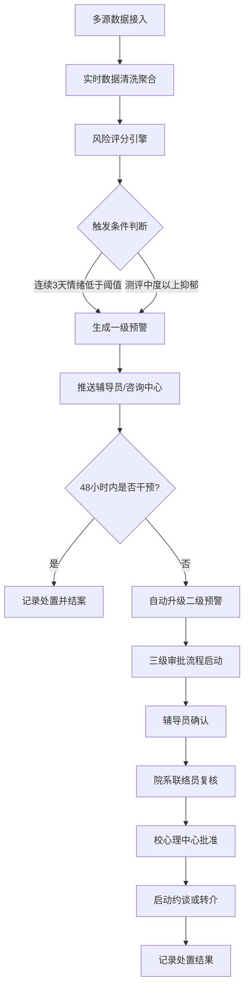
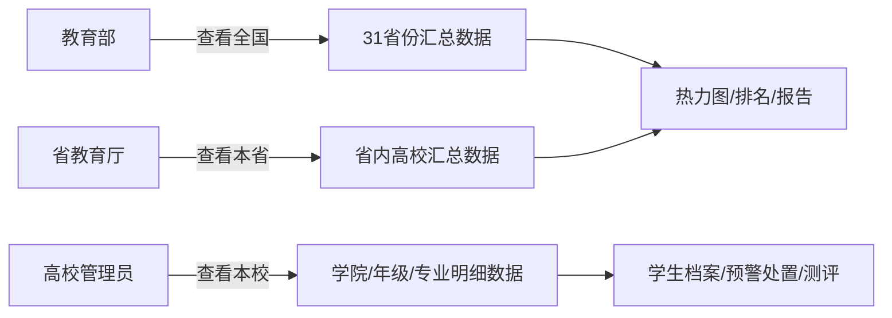

# 全国大学生心理健康监测与危机干预智能分析平台 PRD

## 1. 产品概述
全国性大学生心理健康监测与危机干预智能分析平台，整合多源数据（心理咨询预约、在线心理测评、校园社交情感分析、手机使用行为），实现心理风险实时监测、智能预警、分级干预和全景可视化管理，为教育部、省教育厅及高校提供三级联动的心理健康治理解决方案。

- 核心目标：构建全国高校学生心理健康风险"监测-预警-干预-评估"闭环体系
- 市场价值：支撑教育部《全面加强和改进新时代学生心理健康工作专项行动计划》落地，赋能2900+所高校、4000+万大学生的心理健康管理

## 2. 核心功能

### 2.1 用户角色与权限
| 角色 | 注册方式 | 核心权限 |
|------|----------|----------|
| 教育部管理员 | 系统预置 | 查看全国数据、全国热力图、干预排名、全国报告 |
| 省教育厅管理员 | 教育部授权 | 查看所辖省份数据、省份热力图、本省报告、审批 |
| 学校管理员 | 省厅授权 | 查看本校数据、管理预警、审批流程、上传档案 |
| 心理咨询中心 | 学校授权 | 处理预警、约谈记录、查看测评结果 |
| 院系心理联络员 | 学校授权 | 复核预警、跟进本院学生 |
| 辅导员 | 院系授权 | 确认预警、跟进本班学生、查看预警名单 |

### 2.2 功能模块
1. **登录页**：三级角色选择、登录认证
2. **核心看板**：全国/省份/学校切换、风险热力图、干预效率排名、KPI指标卡
3. **学校详情页**：学院情绪趋势曲线、测评维度分布、危机事件时间线
4. **预警管理**：一级预警列表、二级预警列表、三级审批流程、预警处置
5. **学生档案**：档案列表、Excel批量上传、重点关注名单、既往史追溯
6. **心理测评**：测评结果查询、维度分析、复测对比
7. **周报系统**：每周自动诊断报告、趋势对比、资源配置建议
8. **系统设置**：权限管理、阈值配置、数据接入源管理

### 2.3 页面详情
| 页面名称 | 模块名称 | 功能描述 |
|----------|----------|----------|
| 登录页 | 角色选择卡片 | 三级角色切换登录、表单校验、登录动效 |
| 核心看板 | 顶部导航栏 | 面包屑、角色标识、消息通知、用户菜单 |
| 核心看板 | KPI指标区 | 全国监测学生数、风险学生数、预警处置率、平均响应时长 |
| 核心看板 | 筛选控件 | 省份选择、学校类型（本科/专科/高职）、时间范围 |
| 核心看板 | 全国风险热力图 | ECharts中国地图，按省份风险等级着色，支持点击下钻 |
| 核心看板 | 干预效率排名榜 | TOP10高校柱状图，按平均处置时长/处置率排序 |
| 核心看板 | 风险等级分布饼图 | 安全/低风险/中风险/高风险占比 |
| 核心看板 | 实时预警流 | 滚动展示最新预警事件，支持点击跳转 |
| 学校详情页 | 学校概览卡片 | 学校基本信息、学生总数、当前预警数 |
| 学校详情页 | 学院情绪趋势 | 多学院近7天情绪指数折线图，支持hover详情 |
| 学校详情页 | 测评维度分布 | 抑郁/焦虑/压力/睡眠/社交5维度雷达图/堆叠图 |
| 学校详情页 | 危机事件时间线 | 按时间倒序展示预警-确认-处置-结案全流程 |
| 预警管理 | 预警统计卡片 | 待处理一级预警、待升级二级预警、审批中数量 |
| 预警管理 | 预警列表 | Tab切换一级/二级预警，支持多维筛选、导出 |
| 预警管理 | 预警详情面板 | 学生信息、情绪曲线、触发原因、处置记录 |
| 预警管理 | 三级审批流程 | 可视化审批链、时间戳、审批意见输入 |
| 学生档案 | 档案列表 | 分页表格、搜索筛选、标签展示 |
| 学生档案 | Excel上传 | 拖拽上传、模板下载、解析进度、错误提示 |
| 学生档案 | 档案详情 | 基本信息、既往史、历次测评、预警记录、处置历史 |
| 学生档案 | 重点关注名单 | 预警频次超限学生列表、风险标签、关注建议 |
| 周报系统 | 报告列表 | 按周生成报告，支持预览下载、对比上周 |
| 周报系统 | 报告详情 | 风险分布、响应时长、复测改善率、优化建议 |

## 3. 核心流程

### 3.1 预警触发与升级流程
多源数据流实时接入 → 数据清洗聚合 → 心理风险评分计算 → 
  - 连续3天情绪指数 < 阈值 OR 测评中度+抑郁 → 生成一级预警 → 推送辅导员/咨询中心
  - 48小时未干预 → 自动升级二级预警 → 启动三级审批（辅导员确认→联络员复核→中心批准）→ 约谈/转介

### 3.2 三级权限数据查看流程

## 4. 用户界面设计

### 4.1 设计风格
- **主色调**：深海蓝 (#0F4C81) - 专业、信任、医疗感；辅助色：薄荷绿 (#2EC4B6) - 希望、健康；警示色：橙红 (#FF6B6B) - 高风险、琥珀 (#FFA94D) - 中风险
- **中性色**：以 slate 为基底，层次分明的灰阶系统
- **按钮风格**：圆角10px，主要按钮渐变填充，hover微上浮+阴影加深
- **字体**：标题使用 Noto Serif SC（衬线，庄重感），正文使用 Noto Sans SC（无衬线，高可读性）
- **布局风格**：卡片式布局，精致阴影边框，适度留白，侧栏导航+顶部信息栏
- **图标风格**：Lucide Icons，线性描边，统一2px粗细
- **数据可视化**：ECharts专业配色，渐变填充，动画过渡流畅

### 4.2 页面设计概览
| 页面名称 | 模块名称 | UI元素 |
|----------|----------|--------|
| 登录页 | 角色选择区 | 三栏卡片并排，选中态发光边框，角色图标+标题+描述 |
| 登录页 | 登录表单区 | 毛玻璃面板，输入框浮动标签，登录按钮脉冲动效 |
| 核心看板 | KPI指标卡 | 渐变背景数字，趋势箭头，同比环比小标签 |
| 核心看板 | 热力图区域 | 大屏地图居中，省份hover浮窗，风险等级图例 |
| 核心看板 | 排名榜单 | 金银铜奖牌图标，进度条对比，hover高亮行 |
| 核心看板 | 实时预警流 | 纵向滚动列表，风险色标签，时间戳 |
| 预警管理 | 审批流程条 | 三节点横向时间轴，已完成/进行中/待处理状态色 |
| 学生档案 | 上传区 | 虚线边框拖放区，上传中进度条动画，文件列表 |
| 周报 | 报告卡片 | 期刊风格，封面+目录缩略，翻页动效 |

### 4.3 响应式
- 桌面端优先设计（1440px基准）
- 1280px及以上：完整三栏布局
- 1024px-1279px：两栏布局，右侧内容自适应
- 768px-1023px：单栏布局，侧栏收起为汉堡菜单
- 移动端（<768px）：卡片纵向堆叠，图表缩小展示，操作按钮底部悬浮

### 4.4 交互与动效
- 页面入场：stagger渐入（延迟50ms阶梯动画）
- 数据更新：数字滚动动效、图表平滑过渡
- 预警提示：顶部toast通知+声音提示（可配置）
- 审批节点：状态切换画线动画
- 悬停交互：卡片微上浮(translateY(-2px))、阴影加深
