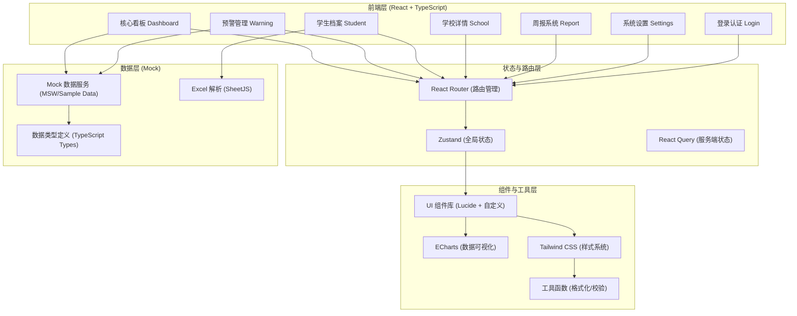
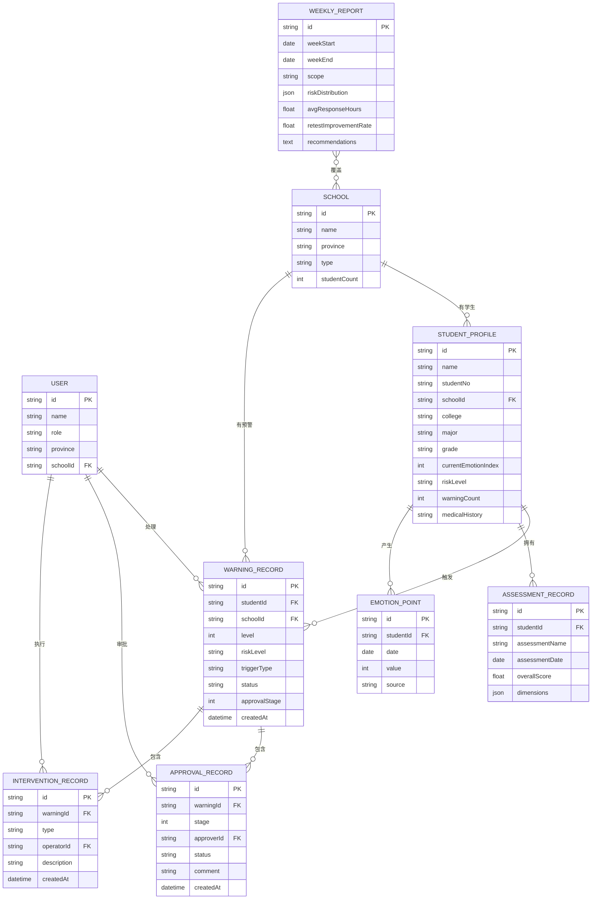

# 全国大学生心理健康监测与危机干预智能分析平台 技术架构

## 1. 架构设计



## 2. 技术说明

- **前端框架**: React@18 + TypeScript@5
- **构建工具**: Vite@5
- **路由管理**: react-router-dom@6
- **状态管理**: zustand@4（轻量状态管理）
- **样式方案**: tailwindcss@3 + PostCSS
- **数据可视化**: echarts@5 + echarts-for-react
- **UI 图标**: lucide-react
- **Excel 处理**: xlsx (SheetJS)
- **HTTP 请求**: axios
- **后端服务**: 纯前端项目，使用Mock数据模拟API

## 3. 路由定义

| 路由路径 | 页面组件 | 权限角色 | 页面说明 |
|----------|----------|----------|----------|
| `/login` | LoginPage | 公开 | 角色选择与登录页 |
| `/dashboard` | DashboardPage | 全部角色 | 核心监控看板 |
| `/dashboard/school/:id` | SchoolDetailPage | 全部角色 | 学校详情下钻页 |
| `/warning` | WarningListPage | 学校/省厅/部里 | 预警管理列表页 |
| `/warning/:id` | WarningDetailPage | 学校角色 | 预警详情与审批页 |
| `/students` | StudentListPage | 学校角色 | 学生档案列表页 |
| `/students/upload` | StudentUploadPage | 学校管理员 | Excel上传页 |
| `/students/focus` | FocusListPage | 学校角色 | 重点关注名单 |
| `/students/:id` | StudentDetailPage | 学校角色 | 学生档案详情 |
| `/reports` | ReportListPage | 全部角色 | 周报列表页 |
| `/reports/:id` | ReportDetailPage | 全部角色 | 周报详情页 |
| `/settings` | SettingsPage | 管理员 | 系统设置页 |
| `*` | NotFoundPage | - | 404页面 |

## 4. 数据类型定义

```typescript
// 用户角色类型
type UserRole = 'ministry' | 'province' | 'school' | 'center' | 'liaison' | 'counselor';

interface User {
  id: string;
  name: string;
  role: UserRole;
  province?: string;
  schoolId?: string;
  avatar?: string;
}

// 学校类型
type SchoolType = '本科' | '专科' | '高职';

interface School {
  id: string;
  name: string;
  province: string;
  type: SchoolType;
  studentCount: number;
  warningCount: number;
  avgResponseHours: number;
  resolutionRate: number;
}

// 省份数据（热力图）
interface ProvinceData {
  name: string;
  value: number; // 综合风险评分
  studentCount: number;
  highRiskCount: number;
  warningCount: number;
}

// KPI指标
interface KPIData {
  totalStudents: number;
  riskStudents: number;
  resolutionRate: number;
  avgResponseHours: number;
  totalComparedToLast: number;
  riskComparedToLast: number;
  resolutionComparedToLast: number;
  responseComparedToLast: number;
}

// 风险等级
type RiskLevel = 'safe' | 'low' | 'medium' | 'high';
type WarningLevel = 1 | 2;

// 预警记录
interface WarningRecord {
  id: string;
  studentId: string;
  studentName: string;
  schoolId: string;
  schoolName: string;
  college: string;
  major: string;
  grade: string;
  level: WarningLevel;
  riskLevel: RiskLevel;
  triggerType: 'emotion' | 'assessment' | 'behavior' | 'composite';
  triggerReason: string;
  emotionIndex: number; // 0-100
  depressionScore: number; // 测评得分
  createdAt: string;
  updatedAt: string;
  escalatedAt?: string; // 升级为二级时间
  status: 'pending' | 'processing' | 'approved' | 'resolved' | 'rejected';
  statusText: string;
  approvalStage?: 0 | 1 | 2 | 3; // 0-未启动, 1-辅导员确认, 2-联络员复核, 3-中心批准
  approvals: ApprovalRecord[];
  interventions: InterventionRecord[];
}

// 审批记录
interface ApprovalRecord {
  id: string;
  warningId: string;
  stage: 1 | 2 | 3;
  stageName: string;
  approverId: string;
  approverName: string;
  approverRole: string;
  status: 'approved' | 'rejected' | 'pending';
  comment?: string;
  createdAt: string;
}

// 干预记录
interface InterventionRecord {
  id: string;
  warningId: string;
  type: 'counsel' | 'referral' | 'contact_family' | 'follow_up' | 'other';
  typeName: string;
  operatorId: string;
  operatorName: string;
  description: string;
  createdAt: string;
  nextFollowUpAt?: string;
}

// 学生档案
interface StudentProfile {
  id: string;
  name: string;
  gender: '男' | '女';
  age: number;
  studentNo: string;
  schoolId: string;
  schoolName: string;
  college: string;
  major: string;
  grade: string;
  className: string;
  phone?: string;
  counselor: string;
  currentEmotionIndex: number;
  riskLevel: RiskLevel;
  warningCount: number; // 历史预警次数
  assessmentHistory: AssessmentRecord[];
  emotionHistory: EmotionPoint[];
  warningHistory: string[]; // 预警ID列表
  medicalHistory?: string; // 既往病史
  familyHistory?: string; // 家族史
  tags: string[];
}

// 测评记录
type AssessmentDimension = 'depression' | 'anxiety' | 'stress' | 'sleep' | 'social';

interface AssessmentRecord {
  id: string;
  studentId: string;
  assessmentName: string; // SCL-90, SDS, SAS等
  assessmentDate: string;
  overallScore: number;
  dimensions: Record<AssessmentDimension, { score: number; level: '正常' | '轻度' | '中度' | '重度' }>;
  conclusion: string;
  isRetest: boolean;
  improvedPercent?: number;
}

// 情绪数据点
interface EmotionPoint {
  date: string;
  value: number; // 0-100
  source: 'social' | 'app_usage' | 'counsel' | 'assessment';
}

// 学院情绪趋势
interface CollegeEmotionTrend {
  collegeName: string;
  data: EmotionPoint[];
}

// 危机事件时间线
interface CrisisEvent {
  id: string;
  time: string;
  type: 'warning' | 'approve' | 'intervene' | 'resolve' | 'followup';
  typeName: string;
  title: string;
  description: string;
  operator?: string;
}

// 周报
interface WeeklyReport {
  id: string;
  weekStart: string;
  weekEnd: string;
  scope: 'national' | 'province' | 'school';
  scopeName: string;
  riskDistribution: Record<RiskLevel, number>;
  avgResponseHours: number;
  avgResponseCompared: number;
  retestImprovementRate: number;
  retestImprovementCompared: number;
  totalWarnings: number;
  warningsCompared: number;
  resolvedWarnings: number;
  recommendations: string[];
  summary: string;
  topRiskSchools?: { name: string; warningCount: number }[];
  charts: {
    riskTrend: { date: string; value: number }[];
    dimensionDistribution: Record<AssessmentDimension, number>;
  };
}
```

## 5. 数据模型关系 (ER图)



## 6. 前端项目目录结构

```
src/
├── assets/              # 静态资源
├── components/          # 通用组件
│   ├── layout/          # 布局组件 (Sidebar, TopBar, ...)
│   ├── charts/          # 图表组件 (HeatMap, LineChart, RadarChart, ...)
│   ├── ui/              # 基础UI组件 (Card, Button, Badge, Modal, ...)
│   └── features/        # 业务组件 (WarningFlow, ApprovalChain, ...)
├── hooks/               # 自定义Hooks
│   ├── useAuth.ts
│   ├── useMockData.ts
│   └── useChartTheme.ts
├── pages/               # 页面组件
│   ├── LoginPage.tsx
│   ├── DashboardPage.tsx
│   ├── SchoolDetailPage.tsx
│   ├── WarningListPage.tsx
│   ├── WarningDetailPage.tsx
│   ├── StudentListPage.tsx
│   ├── StudentUploadPage.tsx
│   ├── StudentDetailPage.tsx
│   ├── FocusListPage.tsx
│   ├── ReportListPage.tsx
│   ├── ReportDetailPage.tsx
│   ├── SettingsPage.tsx
│   └── NotFoundPage.tsx
├── routes/              # 路由配置
│   └── index.tsx
├── store/               # Zustand状态
│   ├── authStore.ts
│   └── appStore.ts
├── types/               # TypeScript类型定义
│   └── index.ts
├── utils/               # 工具函数
│   ├── formatter.ts     # 格式化(日期、数字)
│   ├── validator.ts     # 校验
│   └── mockData/        # Mock数据生成
│       ├── schools.ts
│       ├── warnings.ts
│       ├── students.ts
│       ├── assessments.ts
│       └── reports.ts
├── App.tsx
├── main.tsx
└── index.css            # Tailwind入口 + 全局样式
```
